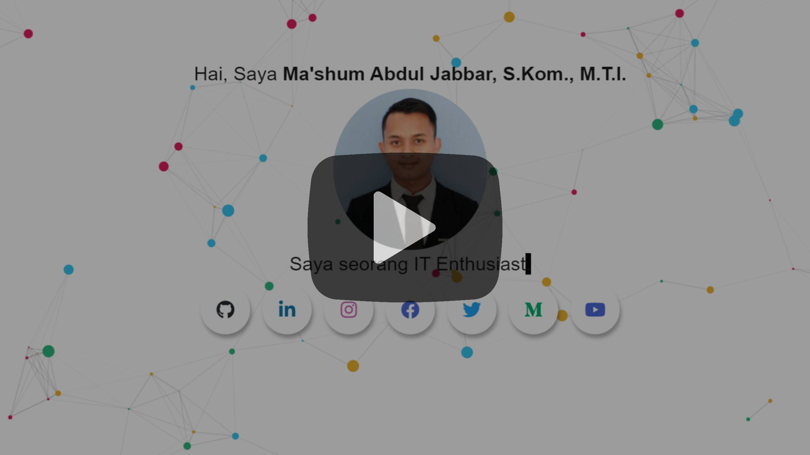

## Kumpulan Portofolio
---

### **2022 :**
<table>
<tr>
	<th>Portfolio Name</th>
	<th>Description</th>
	<th>Screenshoots / Video</th>
	<th>URL</th>
</tr>	
<tr>
	<td>Project Manager</a>
	<td><b>Kelas Pintar</b>
	 
	Keterangan : Revamp Platfrom Belajar Online SD, SMP, SMA </td>
	<td></td>
	<td>
		<ul>
			<li><a href="https://kelaspintar.id" target="_blank">Link</a></li>
		</ul>
	</td>
</tr>
<tr>
	<td>Developer</a>
	<td><b>Ensiklopedia Melayu</b>
	 
	Keterangan :  Aplikasi ini memiliki fitur terjemahan Indonesia-Melayu atau Melayu-Indonesia dan juga memiliki fitur pencarian pantun. Cukup dengan mengetikkan keyword yang ingin dicari. Backend : PHP & MySQL. FrontEnd : Flutter.</td>
	<td></td>
	<td>
		<ul>
			<li><a href="https://play.google.com/store/apps/details?id=id.mashumabduljabbar.ensiklopediamelayu" target="_blank">Link Android</a></li>
		</ul>
	</td>
</tr>
<tr>
	<td>Project Leader</a>
	<td><b>SmartEmployee</b>
	 
	Keterangan :  Aplikasi kepegawaian untuk Tenaga Ahli Jakarta Smart City seperti presensi, kegiatan harian, laporan bulanan, permohonan cuti, dan lainnya. Saya bertugas sebagai Assistant Project Leader di Jakarta Smart City.</td>
	<td></td>
	<td>
		<ul>
			<li><a href="https://employee.jakartasmartcity.id/#/" target="_blank">Link Web</a></li>
			<li><a href="https://play.google.com/store/apps/details?id=id.go.jakarta.smartcity.kepegawaian" target="_blank">Link Android</a></li>
			<li><a href="https://apps.apple.com/id/app/smartemployee/id1629810566?l=id" target="_blank">Link iOS</a></li>
		</ul>
	</td>
</tr>
<tr>
	<td>Project Leader</a>
	<td><b>Vaksinasi Corona</b>
	 
	Keterangan : Vaksinasi Corona adalah aplikasi buatan tim Jakarta Smart City untuk sistem informasi pendaftaran Vaksinasi Covid-19 secara online. Saya bertugas sebagai Assistant Project Leader di Jakarta Smart City.
	</td>
	<td></td>
	<td>
		<ul>
			<li><a href="https://vaksinasi-corona.jakarta.go.id/" target="_blank">Link</a></li>
		</ul>
	</td>
</tr>
<tr>
	<td>Project Manager</a>
	<td><b>Asean Jobs</b>
	 
	Keterangan : ASEAN JOBS adalah pusat informasi pekerjaan online yang menghubungkan pemuda di seluruh kawasan Asia Tenggara. Saya bertugas sebagai konsultan sementara di perusahaan ICT Help sebagai Project Leader. </td>
	<td></td>
	<td>
		<ul>
			<li><a href="https://www.aseanjobs.org/" target="_blank">Link</a></li>
		</ul>
	</td>
</tr>
<tr>
	<td>Developer</a>
	<td><b>Re-Cloud Low-code Competition</b>
	 
	Keterangan : ALICMS sebuah <i>platform</i> untuk membuat web tanpa koding dari AlibabaCloud. Kategori Web : <i>E-Commerce</i>. Toko daring mainan edukasi anak-anak.</td>
	<td></td>
	<td>
		<ul>
			<li><a href="http://w-73850-58883-90290.4724382204.sites.hkalimatch01.shopali.net/" target="_blank">Demo</a></li>
		</ul>
	</td>
</tr>
<tr>
	<td>Developer</a>
	<td><b>Web Portofolio</b>
	 
	Keterangan : Web ini dibuat dengan <i>framework</i> CodeIgniter 3.0 tanpa <i>database</i>, konten web dibuat statik atau secara <i>hard code</i>. Silahkan <i>clone</i> repo jika ingin mencoba.
	</td>
	<td></td>
	<td>
		<ul>
			<li><a href="https://mashumabduljabbar.000webhostapp.com/" target="_blank">Demo</a></li>
			<li><a href="https://github.com/mashumabduljabbar/website-portfolio" target="_blank">Repo</a></li>
		</ul>
	</td>
</tr>
</table>

### **2018-2021 :**

#### Website & Sistem Informasi berbasis Web

* OFON TELEPHONE SERVICE : https://github.com/mashumabduljabbar/myportofolio/tree/master/Web/2017-OFONv1
* Sistem Informasi OFON Teleponi :  https://simfoni.ofon.co.id
* AWM TOUR & TRAVEL : https://github.com/mashumabduljabbar/myportofolio/tree/master/Web/2020-AWMTour
* KATASANDI BLOG : https://github.com/mashumabduljabbar/myportofolio/tree/master/Web/2020-KataSandi
* CORONA VIRUS DISEASE 2019 : https://github.com/mashumabduljabbar/Portfolio/tree/main/Website-Covid-19
* KELAS DICODING : https://mashumabduljabbar.github.io/kelas-dicoding/
* BOX-OFFICE MOVIE : https://github.com/mashumabduljabbar/frontend-dicoding/
* Final Project Python Django Infest Academy : https://github.com/mashumabduljabbar/django-movies-crud
* Membuat CV Berbasis Web : https://github.com/mashumabduljabbar/infest
* Sisfo SMP KHBP Rumbai PKU : https://github.com/mashumabduljabbar/sisfo-hkbp-rumbai
* Sisfo Kursus Mobil : https://github.com/mashumabduljabbar/sisfo-kursusmobil
* SPK Siswa Inklusi Metode AHP : https://github.com/mashumabduljabbar/spk-ahp-siswainklusi
* Naive Bayes Perkiraan Studi Mahasiswa : https://github.com/mashumabduljabbar/spk-naivebayes-perkiraanstudimahasiswa
* SPK PERT Penjadwalan Proyek : https://github.com/mashumabduljabbar/spk-pert-penjadwalanproyek
* SKPI : http://skpi.unilak.ac.id/
* SPK Penentuan Judul Skripsi : https://github.com/mashumabduljabbar/spk-saw-penentuanjudulskripsi
* SPK Penentuan Jurusan : https://github.com/mashumabduljabbar/spk-saw-penentuanjurusan
* Bootcamp Path Pengembangan Web by Progate : https://github.com/mashumabduljabbar/html-sample  
* Konversi Gambar ke Data : https://github.com/mashumabduljabbar/imagetodata
* Aplikasi Grafik untuk Penerimaan Mahasiswa Baru dengan Treemap : https://github.com/mashumabduljabbar/aplikasi-grafik-treemap-pmb
* Aplikasi e-Inventory Laboratorium : https://github.com/mashumabduljabbar/aplikasi-e-inventory-laboratorium
* Aplikasi Notulen Rapat dan Disposisi : https://github.com/mashumabduljabbar/notulen
* Transkrip Aktivitas Kemahasiswaan : https://github.com/mashumabduljabbar/tak
* Aplikasi Bank Soal : https://github.com/mashumabduljabbar/aplikasi-bank-soal
* Hitung Mundur dengan PHP dan Session : https://github.com/mashumabduljabbar/countdown
* Quick Count Pemilu 2019 Pemkot Pekanbaru : https://github.com/mashumabduljabbar/sisfo-quickcountpku
* Sistem Informasi Inventaris Fakultas Ilmu Budaya : https://github.com/mashumabduljabbar/inventoryfib
* Aplikasi Peramalan Stok Barang Minimarket Malayanda : https://github.com/mashumabduljabbar/peramalan-stok-barang-minimarket
* Aplikasi Sistem informasi Point Of Sales Inventory Purchase : https://github.com/mashumabduljabbar/point-of-sales-inventory-purchase
* SPK Fuzzy Tsukamoto Pernikahan : https://github.com/mashumabduljabbar/spk-fuzzytsukamoto-tentangpernikahan
* SPK STAD Smart Cooperative Oriented Problem : https://github.com/mashumabduljabbar/spk-stad-smartcooperativeorientedproblem
* Sistem Informasi OLO : https://github.com/mashumabduljabbar/olo
---
#### Chatbot
* LINE Messaging API Chatbot : https://github.com/mashumabduljabbar/line-chatbot
---
#### Android Cordova, Kotlin dan Java
* Whistle Blowing System : https://github.com/mashumabduljabbar/myportofolio/tree/master/Android/ALIE-PT
* Parameter Wisata Halal : https://github.com/mashumabduljabbar/myportofolio/tree/master/Android/ParameterWisataHalal
* Pencarian User Github dengan Android Kotlin : https://github.com/mashumabduljabbar/GithubSearch
* Project Android untuk menampilkan gambar dan teks dan berpindah halaman. Tema Alat Telekomunikasi : https://github.com/mashumabduljabbar/aplikasi-sejarah-alat-telekomunikasi
---
#### Augmented Reality
* Filter IG - Make Up dan Lensa Kontak : https://github.com/mashumabduljabbar/Portfolio/tree/main/Augmented%20Reality%20-%20Filter%20Make%20Up%20di%20Instagram
* Filter IG - Avenger Mask : https://github.com/mashumabduljabbar/Portfolio/tree/main/Augmented%20Reality%20-%20Filter%20Topeng%20Ant%20Mant%20di%20Instagram
* Snapchat - Background Ketupat : https://github.com/mashumabduljabbar/myportofolio/blob/master/Screenshoots/snapcode-backgroundketupat.png
* Snapchat - Green Skin : https://github.com/mashumabduljabbar/myportofolio/blob/master/Screenshoots/snapcode-greenskin.png 
* Snapchat - Mulut Bebek : https://github.com/mashumabduljabbar/myportofolio/blob/master/Screenshoots/snapcode-mulutbebek.png 
* Snapchat - Tap to Change : https://github.com/mashumabduljabbar/myportofolio/blob/master/Screenshoots/snapcode-taptochange.png
---
#### Data Science, Machine Learning dan Python Apps
* Memprediksi Kepuasan Para Pelanggan Sebuah Maskapai Penerbangan Menggunakan Supervised Machine Learning : https://github.com/mashumabduljabbar/portfolio-data-science/blob/main/Memprediksi_Kepuasan_Para_Pelanggan_Sebuah_Maskapai_Penerbangan_Menggunakan_Supervised_Machine_Learning.ipynb
* CDR Fraud Detection with K-Means and PCA for High Dimensional : https://github.com/mashumabduljabbar/portfolio-data-science/blob/main/fraud-modeling-CDR-K-Means.ipynb
* CDR Fraud Detection with  and DBSCAN and PCA for High Dimensional : https://github.com/mashumabduljabbar/portfolio-data-science/blob/main/fraud-modeling-CDR-DBSCAN.ipynb
* Prediksi Gambar Batu Gunting Kertas (rockscissorspaper) : https://github.com/mashumabduljabbar/python-Dicoding/blob/master/prediksi-gambar-rockscissorspaper.ipynb
* Penerapan Data Mining Memprediksi Putusan Perkara Perceraian Menggunakan Metode Clustering K-Means Pada Pengadilan Agama Pekanbaru : https://github.com/mashumabduljabbar/prediksi-cerai-metode-clustering-k-means
* Bootcamp Python Data Science by Sanbercode : https://github.com/mashumabduljabbar/python-sanbercode
* Bootcamp Python by DTS KOMINFO : https://github.com/mashumabduljabbar/python-DTS-KOMINFO
---
#### Karya Ilmiah
* Jurnal - Fraud Detection Call Detail Record Using Machine Learning in Telecommunications Company : https://astesj.com/v05/i04/p09/
* Jurnal - ANDROID-BASED MALAY ENCYCLOPEDIA USING PATTERN MATCH METHOD : [https://iojs.unida.ac.id/index.php/IJAR/article/view/232](https://iojs.unida.ac.id/index.php/IJAR/article/view/232)
---
#### Webinar/ Seminar/  Konferensi/ Lokakarya/ Simposium
* Video Tutorial : http://bit.ly/videotutorialjabbar
* Kumpulan Video Profile : http://bit.ly/videoprofilejabbar
* Moderator - JSC Talks Vol.15: "Cari Tau Jadwal Vaksinasi Lansia di Jakarta melalui JAKI" - Jakarta Smart City - 25 Mar 2021 : https://www.youtube.com/watch?v=p7Vi77Mtnkc&list=PL3u3tzgrNwSz4xqTHMzY_fgCqOzijXw0D&index=14
* Narasumber - Sharing Knowledge bersama Praktisi Perusahaan/Industri "Cyber Security" dalam proses Pembelajaran Jarak Jauh (PJJ) - Universitas Juanda - 10 Des 2020 : https://www.youtube.com/watch?v=HhsAhuLKu-4
* Ketua Panitia - Webinar Series #1 Menjadi Digital Entrepreneurship untuk Survive di Masa Pandemi - Ikatan Alumni UHMT - 28 Nov 2020 : https://youtu.be/uijfKismTY0
* Narasumber - Kuliah Perdana Peluang Lulusan POLKAM di Industri - Politeknik Kampar - 05 Okt 2020 : https://youtu.be/wxgc9otE36w?t=13008
* Narasumber - Marijo Belajar 30 Menit "PSBB" - Komunitas Marijo Belajar - 01 Okt 2020 : https://www.instagram.com/p/CFw8UeXABPy/
* Narasumber - Studium Generale "How to Prepare Yourself with IT Skills for the Future of Work" - Politeknik Kampar - 03 Juli 2020 : https://www.instagram.com/p/CCKUXitpDQR/
